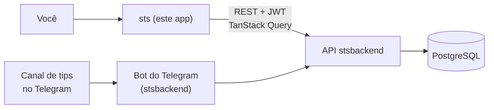

# SportsBet Manager — Dashboard

Dashboard em React para controle de apostas esportivas: registre uma aposta **colando o print do bilhete**, pelo Telegram, ou na mão — depois concilie o saldo por casa e leia ROI e taxa de acerto de verdade.

Backend companheiro: **[stsbackend](https://github.com/BrunoPerioto1/stsbackend)** (API NestJS + PostgreSQL).



Aposta que entra automática pelo Telegram e aposta registrada na mão aqui caem no mesmo lugar — o dashboard só lê e edita o que a API tem.

---

## Destaque: ler o bilhete com IA

O atrito de um controle de apostas é a digitação. Então o modal de "Nova aposta" aceita um print e se preenche sozinho.

**Três entradas, um fluxo:** `Ctrl+V` em qualquer lugar (inclusive na lista de apostas, que abre o modal já lendo), arrastar e soltar, ou input de arquivo — que no celular já é a galeria/câmera.

O que fez valer a pena construir com cuidado:

### A imagem nunca sobe crua

Print de celular é um PNG de 3 MB de cor quase toda chapada. Ele é redimensionado para 1600px no lado maior e reconvertido para WebP (JPEG como fallback em Safari antigo) **no browser** — algumas centenas de KB em vez de megabytes, sem perder legibilidade do texto do bilhete. Tudo dentro de um try/catch que devolve o arquivo original em caso de falha: melhor mandar pesado do que não mandar.

### A IA propõe, o usuário dispõe

Nada é salvo automaticamente. Campo preenchido pelo modelo ganha o selo **IA**; campo que o backend marcou como baixa confiança fica âmbar com o rótulo *confira* e borda destacada. No instante em que você digita por cima, o selo some — dali em diante o valor é seu, não do modelo.

### O sinal humano mais recente ganha

A resolução da casa tem precedência estrita: a legenda digitada (espelhando como você legenda a foto no Telegram) vence o select, que vence a logo lida do print. O que o usuário afirmou explicitamente supera qualquer coisa inferida.

### Vínculo com tip pendente

Se o bilhete bate com uma tip que você já recebeu, o backend devolve as candidatas ranqueadas e o modal oferece o vínculo — melhor candidata pré-marcada, "não vincular" sempre a um clique. O botão de submit vira *Registrar e vincular*, pra ação nunca ser ambígua.

### Detalhes que mordem

- Trocar o print no meio de uma leitura descarta a resposta em voo (guard por id de execução), então uma leitura lenta não sobrescreve uma rápida que veio depois.
- "Trocar"/"Remover" limpam o **formulário inteiro**, não só a miniatura — deixar odd e stake do bilhete anterior na tela enquanto a nova leitura roda é como se registra a aposta errada.
- Object URLs são revogados no unmount e na troca.

---

## Funcionalidades

- **Dashboard** — gráfico de lucro diário/semanal/mensal, métricas de destaque (lucro, ROI, taxa de acerto), apostas recentes e presets rápidos de período.
- **Apostas** — lista paginada e filtrável (status, casa, período, busca livre) com liquidação inline: Ganha, Perdida, Meio Ganha, Meio Perdida, Cashout (pede o valor recebido) ou Cancelada — mais ações em lote e exportação CSV.
- **Nova aposta** — entrada manual ou leitura do bilhete por IA, com vínculo a tip pendente.
- **Casas** — saldo por casa, conciliado a partir de depósitos, saques e resultados das apostas.
- **Comparador** — ranqueia casas por ROI, lucro ou taxa de acerto num período, com pódio e insights gerados (concentração de lucro, casas com desempenho abaixo da média carregando stake acima da média).
- **Tips** — a fila de tips pendentes espelhada do canal do Telegram.
- **Auth** — login por JWT, com vínculo da conta do Telegram pela página de perfil.

Toda tela tem layout mobile de verdade — bottom sheets, não diálogo espremido — porque registrar aposta acontece no celular.

---

## Stack

**React 18** + **TypeScript**, build com **Vite** · **Tailwind CSS** + padrões shadcn/ui (primitivas Radix) · **TanStack Query** para estado de servidor · **React Router** · **Recharts** · **date-fns** · **Axios** · deploy na **Vercel**.

Os tokens de design vivem como CSS variables em `src/index.css` e são registrados no `tailwind.config.ts`, então as cores são nomeadas por papel (`accent`, `accent-text`, `positive`, `negative`) e não por hex.

---

## Organização

```
src/
├── api/
│   ├── apiClient.ts    # instâncias axios por recurso + interceptor de JWT
│   └── routes/         # um arquivo por endpoint
├── components/
│   ├── apostas/        # apostas: lista, filtros, formulário, upload do bilhete
│   ├── dashboard/      # gráficos e cards de métrica
│   ├── layout/         # shell do app, navegação
│   └── ui/             # primitivas shadcn
├── hooks/
│   ├── apostas/        # estado do formulário, leitura do bilhete
│   └── queries/        # wrappers de TanStack Query
├── lib/                # formatação, compressão de imagem, helpers
└── pages/              # telas de rota
```

Os formulários de aposta desktop e mobile são duas apresentações sobre **um** hook (`use-aposta-form`) — mesma validação, mesmo payload, mesmo comportamento de IA. Só o layout muda.

---

## Rodando localmente

```bash
npm install
cp .env.example .env.local   # aponte VITE_API_URL para a sua instância do backend
npm run dev                  # http://localhost:8080
```

| Variável | Descrição |
|---|---|
| `VITE_API_URL` | URL base da API stsbackend (com barra no final) |

```bash
npm run build       # build de produção
npm run typecheck   # tsc sem emitir
npm run lint        # eslint
npm run test        # testes unitários
```

---

## Status

Projeto pessoal, em desenvolvimento ativo. Publicado como peça de portfólio.
