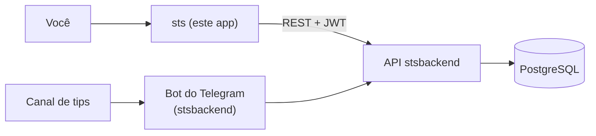
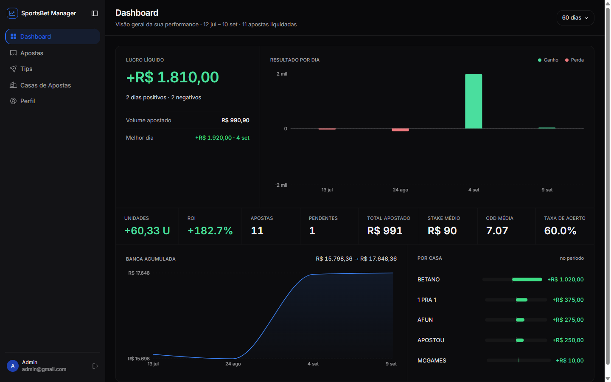
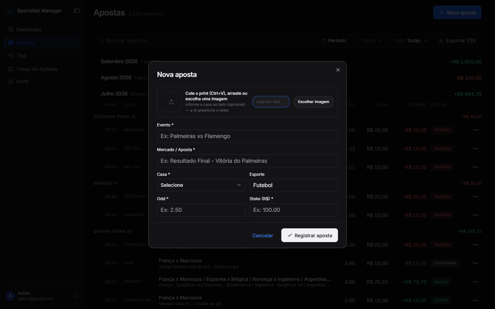
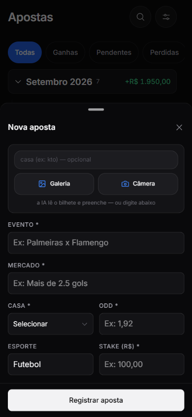
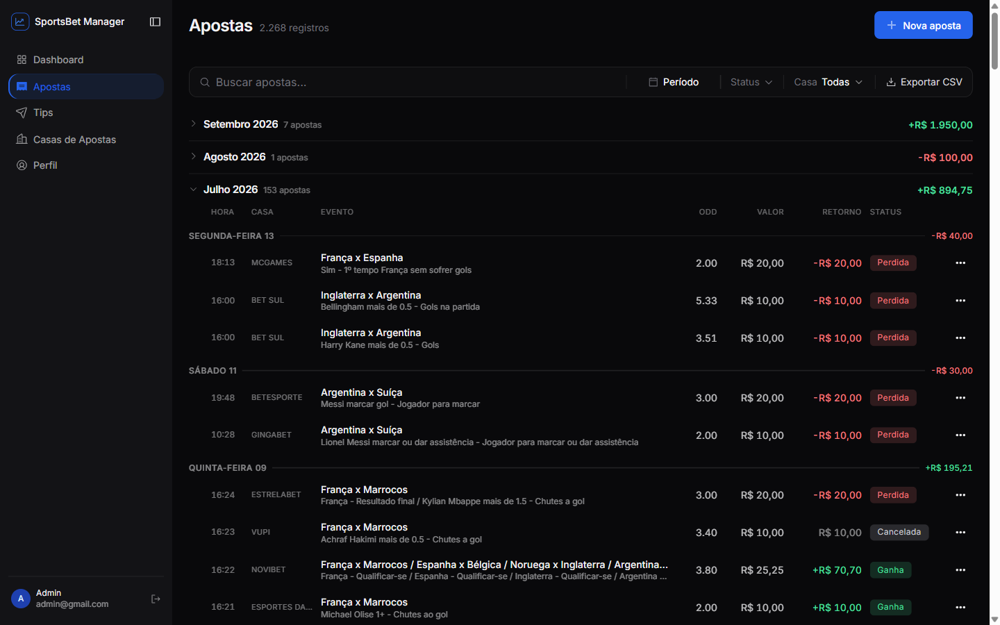
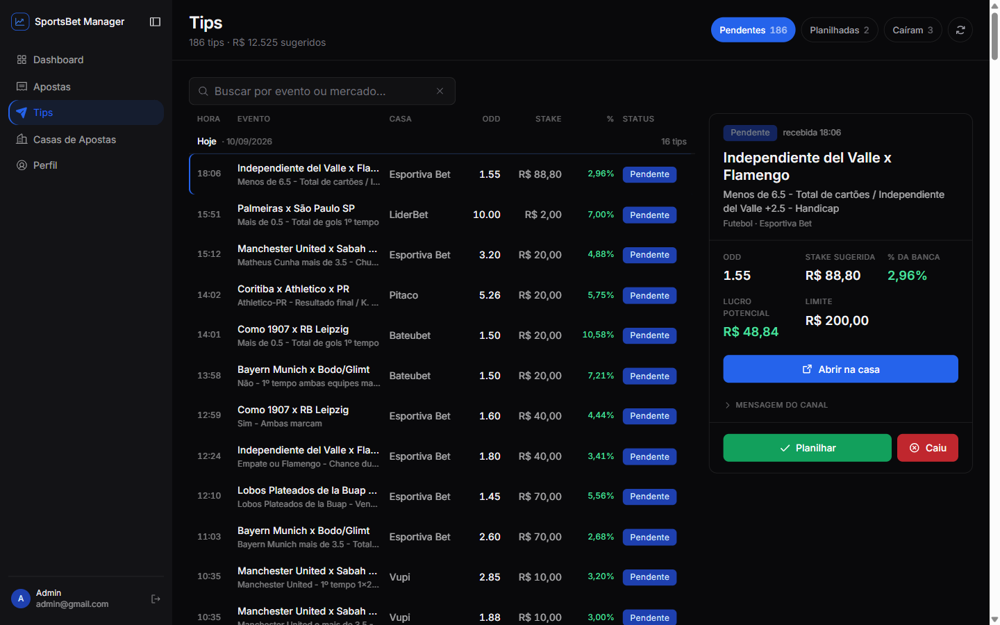
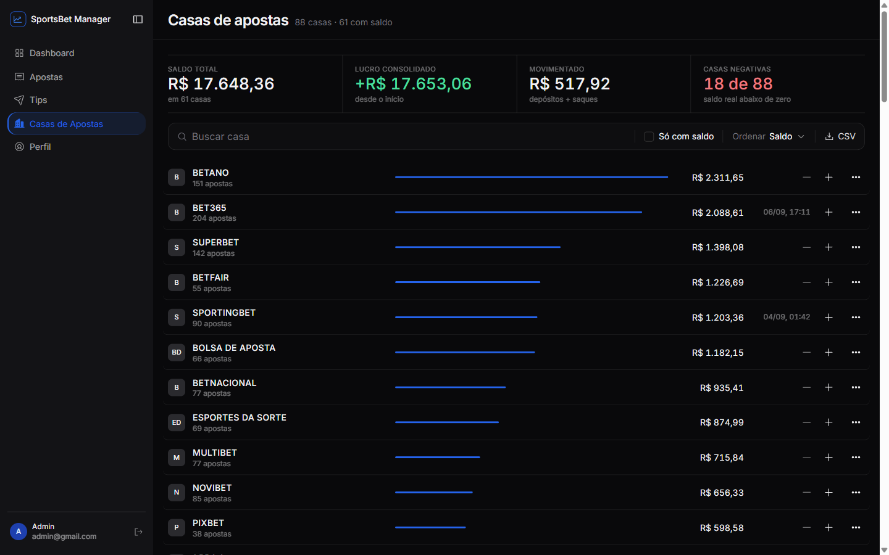
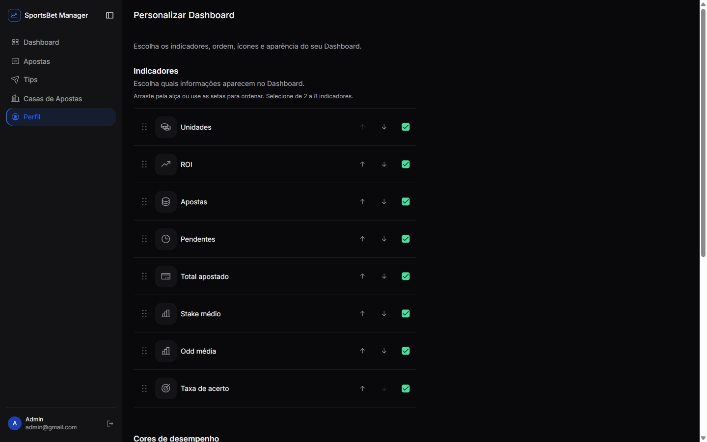
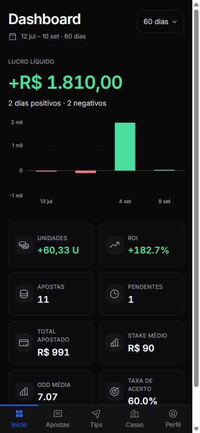

# SportsBet Manager — Dashboard

Dashboard em React pra controlar apostas esportivas. Você registra colando o print do bilhete, deixa o bot do Telegram registrar sozinho, ou digita na mão quando quiser — e depois concilia saldo por casa e olha ROI e taxa de acerto de verdade.

Backend companheiro: **[stsbackend](https://github.com/BrunoPerioto1/stsbackend)**.



Aposta que entra pelo Telegram e aposta digitada aqui caem no mesmo lugar. O dashboard só lê e edita o que a API tem — ele não é dono de nada.




---

## O print que vira formulário

Essa é a parte que eu queria mostrar. O atrito de um controle de apostas é a digitação, então o modal de "Nova aposta" aceita uma imagem e se preenche.

Tem três formas de entrar, e todas caem no mesmo fluxo: `Ctrl+V` em qualquer lugar — inclusive na lista de apostas, que abre o modal já lendo —, arrastar e soltar, ou o input de arquivo, que no celular já abre galeria e câmera direto.



No celular a faixa vira dois botões, Galeria e Câmera:




O que fez a diferença não foi chamar a API. Foi o resto.

**A imagem não sobe crua.** Print de celular é um PNG de 3 MB de cor quase toda chapada. Antes de subir, ele é reduzido pra 1600px no lado maior e reconvertido pra WebP, com JPEG de fallback em Safari antigo. Sai algumas centenas de KB, sem perder nada da legibilidade do texto do bilhete. Se qualquer etapa falhar — canvas bloqueado, formato estranho —, devolve o arquivo original: melhor mandar pesado do que não mandar.

**A IA propõe, você dispõe.** Nada é salvo automático, nunca. Campo preenchido pelo modelo ganha o selo IA; campo que o backend marcou como baixa confiança fica âmbar pedindo conferência. E no instante em que você digita por cima, o selo some — dali pra frente aquele valor é seu, não do modelo, e a tela para de dizer o contrário.

**O sinal humano mais recente ganha.** Pra descobrir a casa existe uma precedência estrita: a legenda que você digita (do mesmo jeito que legenda a foto no Telegram) vence o select, que vence a logo lida do print. Qualquer coisa que você afirmou explicitamente passa na frente de qualquer coisa inferida.

**Vínculo com tip pendente.** Se o bilhete bate com uma tip que já tinha chegado, o backend devolve as candidatas ranqueadas e o modal oferece vincular, com a melhor já marcada e "não vincular" sempre a um clique. O botão muda pra "Registrar e vincular", pra ação nunca ser ambígua.

E alguns detalhes que só aparecem usando: trocar o print no meio de uma leitura descarta a resposta em voo, senão uma leitura lenta sobrescreve a rápida que veio depois. "Trocar" e "Remover" limpam o formulário inteiro e não só a miniatura — deixar odd e stake do bilhete anterior na tela enquanto a nova leitura roda é exatamente como se registra a aposta errada. E os object URLs são revogados no unmount e na troca.

---

## As telas

<table>
  <tr>
    <td width="50%"><br><sub><b>Apostas</b> — 2.268 registros agrupados por mês, liquidação inline e filtros.</sub></td>
    <td width="50%"><br><sub><b>Tips</b> — fila espelhada do canal, com stake sugerida e % da banca.</sub></td>
  </tr>
  <tr>
    <td><br><sub><b>Casas</b> — saldo conciliado em 88 casas.</sub></td>
    <td><br><sub><b>Personalizar dashboard</b> — reordenar, ligar/desligar e trocar o ícone de cada KPI.</sub></td>
  </tr>
</table>




**Dashboard.** Gráfico de lucro diário, semanal ou mensal, cards de métrica no topo, apostas recentes e presets rápidos de período (mês atual, 60 e 90 dias, tudo).

**Apostas.** Lista paginada com filtro por status, casa, período e busca livre. A liquidação é inline: Ganha, Perdida, Meio Ganha, Meio Perdida, Cashout — que pergunta o valor recebido — ou Cancelada. Tem seleção múltipla pra resolver várias de uma vez, e agrupamento por evento.

**Nova aposta.** O modal descrito acima, com entrada manual sempre disponível em paralelo.

**Casas.** Saldo por casa, reconciliado a partir de depósitos, saques e resultados. Junto vem o comparador, que ranqueia por ROI, lucro ou taxa de acerto num período, com pódio e insights gerados — concentração de lucro, casa performando abaixo da média mas carregando stake acima dela.

**Tips.** A fila espelhada do canal, em três abas: pendentes, planilhadas e caíram. Dá pra planilhar direto daqui ou descartar, e desfazer o descarte.

**Perfil.** Virou uma área com sub-rotas próprias:

- *Conta* — identidade e exclusão de conta
- *Senha* — troca de senha
- *Telegram* — vínculo e desvínculo da conta do bot
- *Preferências* — banca e o "avisar só acima de", que é o filtro de percentual mínimo das tips
- *Dashboard* — customização dos KPIs

A customização do dashboard é mais do que parece: você reordena os cards arrastando, liga e desliga cada um, escolhe o ícone de cada KPI a partir de um registry, e define as cores de valor positivo e negativo. Tem restaurar padrão e anúncios de acessibilidade no reordenamento, porque arrastar com o teclado precisava funcionar também.

**Exportação.** Apostas, movimentações e resumo mensal, cada um em CSV com separador ponto-e-vírgula, que é o que o Excel em português espera. É a saída pra planilha e pra declaração de imposto.

**Auth.** Login com JWT e rota protegida.

Toda tela tem layout mobile de verdade, com bottom sheet em vez de diálogo espremido. Não é firula: registrar aposta acontece no celular, quase sempre em pé.

---

## Stack

React 18 com TypeScript, build no Vite. Tailwind com os padrões do shadcn/ui sobre primitivas Radix. TanStack Query cuidando de estado de servidor, React Router nas rotas, Recharts nos gráficos, date-fns nas datas e Axios no HTTP. Deploy na Vercel.

Os tokens de design são CSS variables em `src/index.css`, registradas no `tailwind.config.ts`. Isso é o que permite escrever `text-accent-text` ou `bg-positive` em vez de espalhar hex pelo código — a cor é nomeada pelo papel que exerce, e trocar o tema é mexer num arquivo.

---

## Organização

```
src/
├── api/
│   ├── apiClient.ts    instâncias axios por recurso + interceptor de JWT
│   └── routes/         um arquivo por endpoint
├── components/
│   ├── apostas/        lista, filtros, formulário, upload do bilhete
│   ├── dashboard/      gráficos, cards de KPI, registry de ícones
│   ├── house/          saldos e comparador
│   ├── tips/           fila de tips
│   ├── perfil/         cards de conta, preferências, exportação
│   ├── layout/         shell e navegação
│   └── ui/             primitivas shadcn
├── hooks/
│   ├── apostas/        estado do formulário, leitura do bilhete
│   ├── dashboard/      preferências de KPI
│   └── queries/        wrappers de TanStack Query
├── lib/                formatação, compressão de imagem, exportação CSV
└── pages/              telas de rota
```

Vale notar uma decisão: os formulários de aposta do desktop e do mobile são duas apresentações sobre **um** hook, o `use-aposta-form`. Mesma validação, mesmo payload, mesmo comportamento da IA. Só o layout muda. Foi isso que evitou que a leitura do bilhete precisasse ser implementada duas vezes.

---

## Rodando

```bash
npm install
cp .env.example .env.local   # aponte VITE_API_URL pro seu backend
npm run dev                  # http://localhost:8080
```

Só existe uma variável: `VITE_API_URL`, a URL base da API do stsbackend, com barra no final.

```bash
npm run build
npm run typecheck
npm run lint
npm run test
```

---

## Status

Projeto pessoal, em desenvolvimento ativo. Está aqui como portfólio.

O app está no ar em **[stsfront.vercel.app](https://stsfront.vercel.app)**, mas o login é fechado: a instância
guarda movimentação financeira real, então não publico credenciais de demonstração. Os prints acima são da
aplicação rodando. Se quiser navegar por dentro, me chama que eu abro um acesso.
