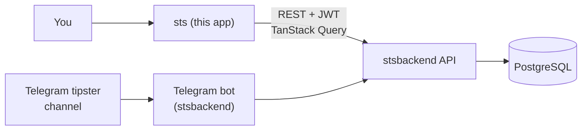

# Betting Tracker — Dashboard

A React dashboard for tracking sports bets: log entries manually or via a Telegram bot, reconcile balances per bookmaker, and read real ROI/hit-rate analytics.

Companion backend: **stsbackend** (NestJS + PostgreSQL API) — separate repository.



Bets logged automatically from Telegram and bets logged by hand in this dashboard land in the same place — the dashboard just reads and edits whatever the API has.

## Features

- **Dashboard** — daily/weekly/monthly profit chart, headline metrics (profit, ROI, hit rate), and recent bets, with quick date-range presets (current month, 60/90 days, all time).
- **Bets** — paginated, filterable list (status, bookmaker, date range, free text) with inline settlement: Won, Lost, Half-Won, Half-Lost, Cashout (prompts for the received amount), or Canceled — plus bulk actions and CSV export.
- **Bookmakers** — balance per bookmaker reconciled from deposits, withdrawals, and bet results.
- **Comparator** — ranks bookmakers by ROI, profit, or hit rate over a period, with a podium view and auto-generated insights (e.g. concentration of profit, underperforming bookmakers with above-average stakes).
- **Auth** — login backed by the API's JWT auth, with account-level Telegram linking from the profile page.

## Tech stack

- **React 18** + **TypeScript**, built with **Vite**
- **Tailwind CSS** + shadcn/ui component patterns (Radix UI primitives)
- **TanStack Query** for server state, **React Router** for routing
- **Recharts** for charts, **Phosphor Icons** / **lucide-react** for icons
- **react-hook-form** + **zod** for forms, **date-fns** for date handling
- **Axios** for HTTP

## Getting started

```bash
npm install
cp .env.example .env.local   # set VITE_API_URL to your backend instance
npm run dev
```

The app runs at `http://localhost:8080` and talks to the **stsbackend** API via the `VITE_API_URL` env var.

## Build

```bash
npm run build
```

## Status

Personal project, actively developed. Showcased here as a portfolio piece.
